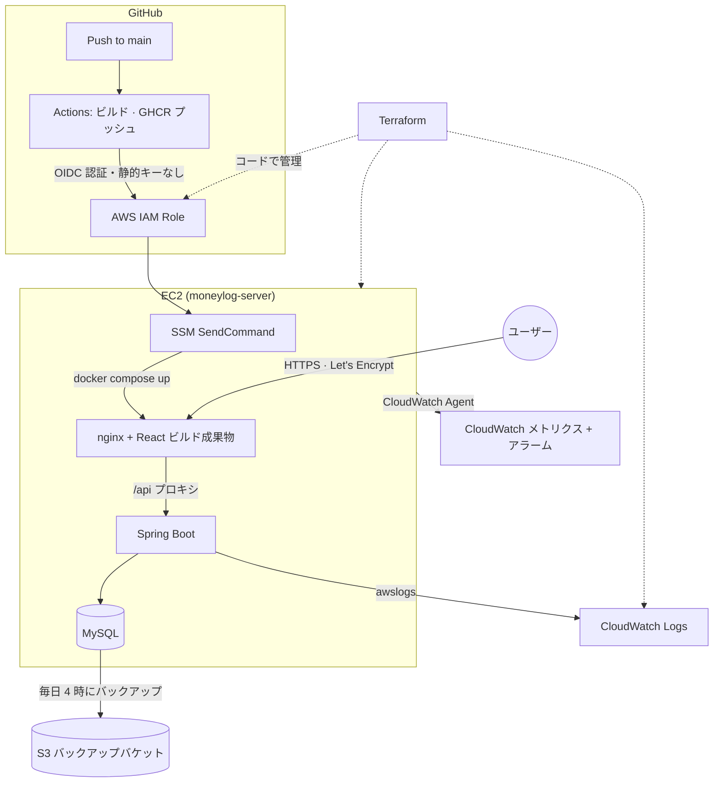

# マネーログ (MoneyLog)

     

[한국어](README.md) · **日本語**

ログインした個人ユーザーが収入・支出を記録し、カテゴリ別・月別の統計を確認する家計簿ウェブサービスです。「自分のデータには自分だけがアクセスできる」という認可（Authorization）の原則を設計の中心に据えています。

- **デプロイ URL**: https://sunwoomoneylog.duckdns.org
- **デモアカウント**: `demo@example.com` / `demo1234` — 登録なしでそのままご覧いただけます
- **API ドキュメント（Swagger）**: https://sunwoomoneylog.duckdns.org/swagger-ui.html
- **要件・設計ドキュメント**: [docs/requirements.md](docs/requirements.md) · [docs/erd.md](docs/erd.md) · [docs/api-spec.md](docs/api-spec.md) — `docs/` 配下の詳細な技術文書は韓国語で書かれています

## 画面

**取引履歴** — 月・種別・カテゴリで絞り込み、表示中のページの収入・支出の合計も併せて表示します。


**月別統計** — 総収入・総支出・残高と、カテゴリ別の支出の割合。


## このプロジェクトを作った理由

日本でクラウド・インフラエンジニアとしてキャリアをスタートすることを目標にしており、その過程で計画的な資金管理が必要だったため、このプロジェクトを始めました。そのため最初から「多くの人のための家計簿」ではなく、「自分が毎日実際に使うツール」を目指して設計しています。

## なぜインフラに注力したのか

このプロジェクトの前に、2つのチーム開発（1次チームプロジェクト prep2gether、ブートキャンプ最終チームプロジェクト「展示会予約管理プラットフォーム」）で Java/Spring Boot + React による協業開発の経験はすでに積んでいます。そこでマネーログでは意図的に別の目標を立てました。**基本機能は速く正確に仕上げて実際に動くサービスを作り、そこで確保した時間をプロダクションレベルのクラウド運用能力に投資する**ことです。

その結果このリポジトリには、「デプロイできた」で終わらず、実運用中のサービスが直面する課題 — 認証の仕組み、安全なデプロイ、可観測性、障害復旧、インフラの再現性 — を一つずつ実践し記録した過程が残っています。

| 領域 | 取り組んだ内容 | ドキュメント |
|---|---|---|
| CI/CD 認証 | 静的アクセスキーの代わりに GitHub OIDC で AWS に認証し、SSM 経由でデプロイ（SSH ポートは完全に閉鎖） | [troubleshooting-oidc-ssm-deploy.md](docs/troubleshooting-oidc-ssm-deploy.md) |
| HTTPS | Let's Encrypt 証明書を無停止（webroot 方式）で発行し、cron による自動更新を検証。その後、固定 IP がなくてもドメインが切れないよう DuckDNS の動的 DNS と IP 自動更新スクリプトに移行 | [devops-roadmap.md](docs/devops-roadmap.md) |
| CI/CD の動作条件 | ワークフローごとのトリガー・パス条件、デプロイ設定値の保存場所の整理 | [cicd-pipeline-reference.md](docs/cicd-pipeline-reference.md) |
| デプロイの安定性 | イメージの sha タグを用いたロールバックのリハーサル（実際に前のバージョンへ戻して復旧まで確認） | [rollback-drill.md](docs/rollback-drill.md) |
| 可観測性 | Docker の awslogs によるコンテナログ収集、CloudWatch Agent によるメモリ・ディスクのメトリクス収集、しきい値アラーム（SNS） | [cloudwatch-setup.md](docs/cloudwatch-setup.md) |
| 障害復旧 | DB の自動バックアップ（S3）と、実際にテーブルを削除して復旧まで検証したリハーサル | [backup-restore-drill.md](docs/backup-restore-drill.md) |
| インフラの再現性 | コンソールで作成したインフラ 6 グループ・15 リソースを `terraform import` でコード化し、`plan` が差分なしになるまで検証。state はローカルではなくバージョニングを有効にした S3 バックエンドに置き、PC が失われてもインフラの管理権を失わないようにした | [terraform-import.md](docs/terraform-import.md) |
| 協業ワークフロー | trunk-based のブランチ戦略、PR 必須・CI 通過必須のブランチ保護ルール、squash マージのみ許可 | [branching-strategy.md](docs/branching-strategy.md) |
| 実践的なトラブルシューティング | デプロイ用ドメイン変更後の CORS エラー、そして README のとおりにローカルで動くかを実際に検証して判明した三つの原因（プロキシ・証明書・ポート衝突） | [troubleshooting-cors-signup.md](docs/troubleshooting-cors-signup.md) · [troubleshooting-local-docker-run.md](docs/troubleshooting-local-docker-run.md) |
| 認可の検証 | 中心となる原則をドキュメントではなくテストで固定 — 他人のデータへのアクセスは 404、トークン検証、カテゴリのタイプ変更の禁止など統合テスト 17 件を PR ごとに CI で実行 | [authorization/](backend/src/test/java/com/moneylog/backend/authorization) |
| 全体ロードマップ | 上記の項目を計画した段階別の DevOps 学習ロードマップ | [devops-roadmap.md](docs/devops-roadmap.md) |

このうち多く（OIDC、IaC、可観測性、バックアップ／復旧リハーサル）は、一般的な新卒のポートフォリオではあまり扱われない、実際の運用経験がなければ出てこない項目です。各ステップをなぜここまで広げたのか、そして費用と時間の制約の中でどのトレードオフを選んだのかは [devops-roadmap.md](docs/devops-roadmap.md) にまとめています。

## 技術スタック

| 領域 | 使用技術 |
|---|---|
| Backend | Java 21, Spring Boot 3.x, Spring Data JPA, Spring Security + JWT, Bean Validation, springdoc-openapi(Swagger), MySQL 8 |
| Frontend | React 19, Vite, react-router-dom, axios |
| Infra / DevOps | Docker（マルチステージビルド）, Docker Compose, GitHub Actions（OIDC 認証）, AWS（EC2 · S3 · CloudWatch · IAM · SSM）, Terraform, Let's Encrypt, DuckDNS, nginx |

## アーキテクチャ概要



AWS リソース（EC2・セキュリティグループ・IAM・S3・CloudWatch）は Terraform のコードで、デプロイ経路はワークフローファイルで定義しています。ただし **インスタンス内部の設定 — 証明書の自動更新 cron、DuckDNS の IP 更新、DB バックアップスクリプト、`.env` — は今のところ手作業で構成しています。** 仮に今インスタンスが失われた場合、`terraform apply` でインフラ自体は復旧しますが、これらの設定は再び手で入れ直す必要があります。この部分を user_data または Ansible に移すことが次のステップです。

## 基本機能

会員登録・ログイン（JWT 認証）、カテゴリと取引履歴の CRUD、ページング・ソート、月別統計の照会を含む要件の全体は [docs/requirements.md](docs/requirements.md) に、API 仕様は [docs/api-spec.md](docs/api-spec.md) にまとめています（いずれも韓国語）。

## ローカルでの実行方法

```bash
git clone https://github.com/DANIELSUNWOO/moneylog.git
cd moneylog
cp .env.example .env   # DB_PASSWORD, JWT_SECRET などを設定（JWT_SECRET は openssl rand -base64 32 で生成）
docker compose up -d --build
```

- フロントエンド: http://localhost
- バックエンド Swagger: http://localhost:8080/swagger-ui.html
- MySQL（Workbench などの GUI クライアント接続用）: localhost:3307

`docker-compose.yml`（本番基準）に `docker-compose.override.yml`（ローカル専用のビルド・ポート設定）が自動的にマージされます。override ファイルは EC2 には配置しないため、ローカルでのみ必要な設定（イメージのビルド、8080/3307 ポートの公開）が本番のデプロイに混ざることはありません。

## 今後の予定

残りの期間は新しい機能を増やすよりも、今あるものの完成度を上げることに使います。次の目標は、上に挙げたインスタンス内部の設定（証明書更新の cron、DuckDNS の IP 更新、DB バックアップスクリプト）をコードに移し、インスタンスが失われても手で入れ直すものが残らない状態にすることです。予算機能・統計の可視化・CSV エクスポートといった機能拡張はその次の順番になります。
