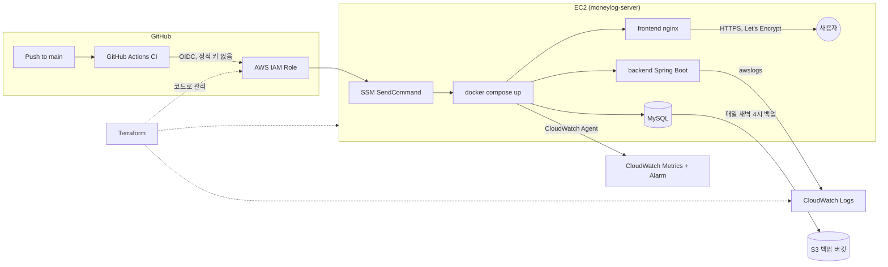

# 머니로그 (MoneyLog)

     

로그인한 개인 사용자가 수입·지출을 기록하고, 카테고리별·월별 통계를 확인하는 가계부 웹서비스입니다. "내 데이터는 나만 접근한다"는 인가(Authorization) 원칙을 핵심으로 설계했습니다.

> **English** — MoneyLog is a personal budget-tracking web app (Spring Boot + React, deployed on AWS EC2 via Docker/GitHub Actions/Terraform). Live: https://sunwoomoneylog.duckdns.org · Swagger: https://sunwoomoneylog.duckdns.org/swagger-ui.html. The detailed write-ups under `docs/` are in Korean, but I'm happy to walk through any part of this project in English as well.

> **日本語** — こんにちは。このプロジェクトは、計画的な支出管理のために開発した個人用家計簿サービスです（Spring Boot + React、AWS EC2 上で Docker/GitHub Actions/Terraform を用いて運用）。詳細な技術文書は韓国語で書かれていますが、必要であれば日本語でもご説明できます。

- **배포 URL**: https://sunwoomoneylog.duckdns.org
- **API 문서(Swagger)**: https://sunwoomoneylog.duckdns.org/swagger-ui.html
- **요구사항/설계 문서**: [docs/requirements.md](docs/requirements.md) · [docs/erd.md](docs/erd.md) · [docs/api-spec.md](docs/api-spec.md)

## 이 프로젝트를 만든 이유

일본에서 클라우드·인프라 엔지니어로 커리어를 시작하는 걸 목표로 하고 있고, 그 과정에서 계획적인 자금 관리가 필요해서 이 프로젝트를 시작했습니다. 동시에 배운 기술을 복습할 좋은 핑계이기도 했고요. 그래서 이 프로젝트는 처음부터 "많은 사람을 위한 가계부"가 아니라 "제가 매일 실제로 쓰는 도구"를 목표로 설계했습니다.

> **日本語** — 日本でクラウド・インフラエンジニアとしてキャリアをスタートすることを目標にしており、その過程で計画的な資金管理が必要だったため、このプロジェクトを始めました。同時に、これまで学んだ技術を復習する良い口実でもありました。そのため、このプロジェクトは最初から「多くの人のための家計簿」ではなく、「私自身が毎日実際に使うツール」を目指して設計しています。

## 왜 인프라에 집중했는가

이 프로젝트 이전에 두 개의 팀 프로젝트(1차 팀 프로젝트 prep2gether, 부트캠프 파이널 팀 프로젝트 "박람회 예약 관리 플랫폼")에서 Java/Spring Boot + React 기반 협업 개발 경험은 이미 쌓았습니다. 그래서 머니로그는 의도적으로 다른 목표를 잡았습니다: **기본 기능은 빠르고 정확하게 완성해 실제로 동작하는 서비스를 만들고, 거기서 확보한 시간을 프로덕션 수준의 클라우드 운영 역량에 투자**하는 것입니다.

그 결과 이 저장소에는 "배포됐다"에서 끝나지 않고, 실제로 운영 중인 서비스가 마주치는 문제들 — 인증 체계, 무중단 배포, 관측성, 장애 복구, 인프라 재현성 — 을 하나씩 실습하고 기록한 과정이 남아 있습니다.

| 영역 | 실습 내용 | 문서 |
|---|---|---|
| CI/CD 인증 | 정적 액세스 키 대신 GitHub OIDC로 AWS에 인증, SSM으로 배포(SSH 포트 완전 차단) | [troubleshooting-oidc-ssm-deploy.md](docs/troubleshooting-oidc-ssm-deploy.md) |
| HTTPS | Let's Encrypt 인증서를 무중단(webroot 방식)으로 발급, cron으로 자동 갱신 검증. 이후 고정 IP가 없어도 배포 도메인이 끊기지 않도록 DuckDNS 동적 DNS + 자동 IP 갱신 스크립트로 전환 | [devops-roadmap.md](docs/devops-roadmap.md) |
| CI/CD 동작 조건 | 워크플로별 트리거·경로 조건, 배포 설정값 저장 위치 정리 | [cicd-pipeline-reference.md](docs/cicd-pipeline-reference.md) |
| 배포 안정성 | 이미지 sha 태깅 기반 롤백 리허설(실제로 이전 버전으로 되돌렸다가 복구) | [rollback-drill.md](docs/rollback-drill.md) |
| 관측성 | Docker awslogs로 컨테이너 로그 수집, CloudWatch Agent로 메모리·디스크 지표 수집, 임계치 알람(SNS) | [cloudwatch-setup.md](docs/cloudwatch-setup.md) |
| 장애 복구 | DB 자동 백업(S3) + 실제 테이블을 지우고 복구까지 검증한 리허설 | [backup-restore-drill.md](docs/backup-restore-drill.md) |
| 인프라 재현성 | 콘솔로 만들었던 인프라 6개 그룹·15개 리소스를 `terraform import`로 코드화, `plan` 결과 무변경 검증 | [terraform-import.md](docs/terraform-import.md) |
| 협업 워크플로우 | trunk-based 브랜치 전략 + PR 필수·CI 통과 필수 브랜치 보호 규칙, squash-only 병합 | [branching-strategy.md](docs/branching-strategy.md) |
| 실전 트러블슈팅 | 배포 도메인 전환 후 발생한 CORS 오류 원인 분석·해결 | [troubleshooting-cors-signup.md](docs/troubleshooting-cors-signup.md) |
| 전체 로드맵 | 위 항목들을 계획한 단계별 DevOps 학습 로드맵 | [devops-roadmap.md](docs/devops-roadmap.md) |

이 중 상당수(OIDC, IaC, 관측성, 백업/복구 리허설)는 일반적인 신입 포트폴리오에서 잘 다루지 않는, 실제 운영 경험이 있어야 나오는 항목들입니다. 각 단계를 왜 교안 범위 밖까지 확장했는지, 그리고 비용·시간 안에서 어떤 트레이드오프를 선택했는지는 [devops-roadmap.md](docs/devops-roadmap.md)에 정리되어 있습니다.

## 기술 스택

**Backend**: Java 21, Spring Boot 3.x, Spring Data JPA, Spring Security + JWT, Bean Validation, springdoc-openapi(Swagger), MySQL 8
**Frontend**: React 19, Vite, react-router-dom, axios
**Infra / DevOps**: Docker(멀티스테이지 빌드), Docker Compose, GitHub Actions(OIDC 인증), AWS(EC2 · S3 · CloudWatch · IAM · SSM), Terraform, Let's Encrypt, DuckDNS, nginx

## 아키텍처 개요



모든 화살표는 콘솔 클릭이 아니라 코드(워크플로우 파일, Terraform)로 정의되어 있습니다.

## 기본 기능

회원가입/로그인(JWT 인증), 카테고리·거래 내역 CRUD, 페이징·정렬, 월별 통계 조회를 포함한 전체 요구사항은 [docs/requirements.md](docs/requirements.md)에, API 명세는 [docs/api-spec.md](docs/api-spec.md)에 정리되어 있습니다.

## 실행 방법 (로컬)

```bash
git clone https://github.com/DANIELSUNWOO/moneylog.git
cd moneylog
cp .env.example .env   # DB_PASSWORD, JWT_SECRET 등을 채운다 (JWT_SECRET: openssl rand -base64 32)
docker compose up -d --build
```

- 프론트엔드: http://localhost
- 백엔드 Swagger: http://localhost:8080/swagger-ui.html
- MySQL(Workbench 등 GUI 클라이언트 연결용): localhost:3307

`docker-compose.yml`(운영 기준)에 `docker-compose.override.yml`(로컬 전용 빌드·포트 설정)이 자동으로 병합됩니다. override 파일은 EC2에 올라가지 않으므로, 로컬에서만 필요한 설정(이미지 빌드, 8080/3307 포트 노출)이 운영 배포에는 섞이지 않습니다.

## 다음 계획

예산 기능, 통계 시각화, 검색/CSV export, 테스트 코드 등 도전 과제 항목은 로드맵상 인프라 작업 이후 순서로, 남은 기간에 여유가 되는 만큼 진행할 예정입니다.
