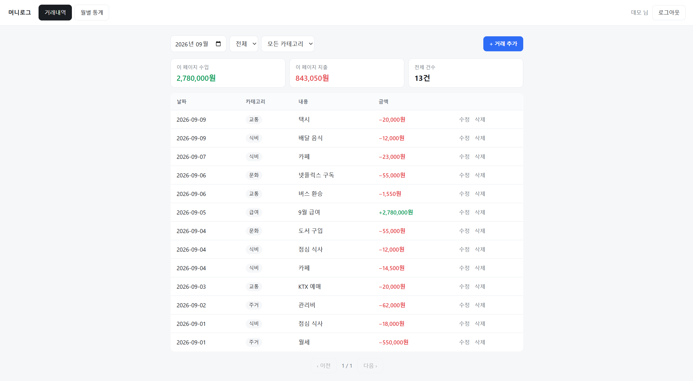
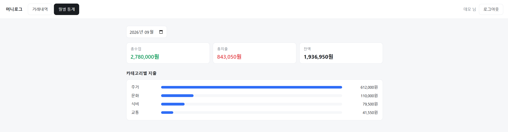
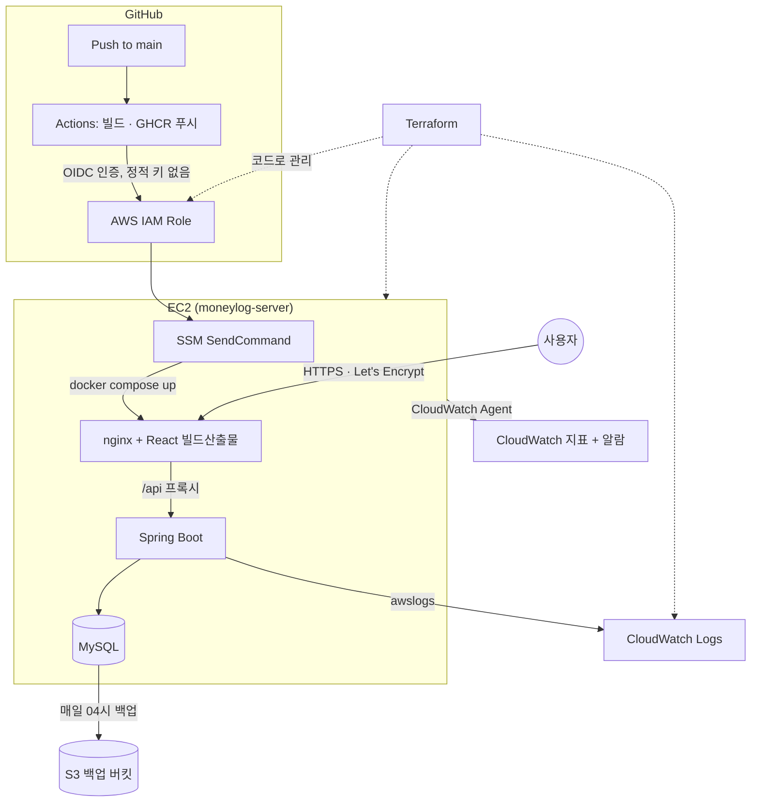

# 머니로그 (MoneyLog)

[](https://github.com/DANIELSUNWOO/moneylog/actions/workflows/ci-backend.yml)      

**한국어** · [日本語](README.ja.md)

로그인한 개인 사용자가 수입·지출을 기록하고, 카테고리별·월별 통계를 확인하는 가계부 웹서비스입니다. "내 데이터는 나만 접근한다"는 인가(Authorization) 원칙을 핵심으로 설계했습니다.

- **배포 URL**: https://sunwoomoneylog.duckdns.org
- **데모 계정**: `demo@example.com` / `demo1234` — 가입 없이 바로 둘러보실 수 있습니다
- **API 문서(Swagger)**: https://sunwoomoneylog.duckdns.org/swagger-ui.html
- **요구사항/설계 문서**: [docs/requirements.md](docs/requirements.md) · [docs/erd.md](docs/erd.md) · [docs/api-spec.md](docs/api-spec.md)

## 화면

**거래내역** — 월·타입·카테고리로 걸러 보고, 조회한 페이지의 수입·지출 합계를 함께 보여줍니다.



**월별 통계** — 총수입·총지출·잔액과 카테고리별 지출 비중.



## 이 프로젝트를 만든 이유

지출이 어디로 새는지 파악이 안 돼서 답답했던 게 시작이었습니다. 그래서 처음부터 "많은 사람을 위한 가계부"가 아니라 "제가 매일 실제로 쓰는 도구"를 목표로 설계했습니다.

## 인프라에서 다룬 것들

이 저장소에는 "배포됐다"에서 끝나지 않고, 실제로 운영 중인 서비스가 마주치는 문제들 — 인증 체계, 무중단 배포, 관측성, 장애 복구, 인프라 재현성 — 을 하나씩 실습하고 기록한 과정이 남아 있습니다.

| 영역 | 실습 내용 | 문서 |
|---|---|---|
| CI/CD 인증 | 정적 액세스 키 대신 GitHub OIDC로 AWS에 인증, SSM으로 배포(SSH 포트 완전 차단) | [troubleshooting-oidc-ssm-deploy.md](docs/troubleshooting-oidc-ssm-deploy.md) |
| HTTPS | Let's Encrypt 인증서를 무중단(webroot 방식)으로 발급, cron으로 자동 갱신 검증. 이후 고정 IP가 없어도 배포 도메인이 끊기지 않도록 DuckDNS 동적 DNS + 자동 IP 갱신 스크립트로 전환 | [devops-roadmap.md](docs/devops-roadmap.md) |
| CI/CD 동작 조건 | 워크플로별 트리거·경로 조건, 배포 설정값 저장 위치 정리 | [cicd-pipeline-reference.md](docs/cicd-pipeline-reference.md) |
| 배포 안정성 | 이미지 sha 태깅 기반 롤백 리허설(실제로 이전 버전으로 되돌렸다가 복구) | [rollback-drill.md](docs/rollback-drill.md) |
| 관측성 | Docker awslogs로 컨테이너 로그 수집, CloudWatch Agent로 메모리·디스크 지표 수집, 임계치 알람(SNS) | [cloudwatch-setup.md](docs/cloudwatch-setup.md) |
| 장애 복구 | DB 자동 백업(S3) + 실제 테이블을 지우고 복구까지 검증한 리허설 | [backup-restore-drill.md](docs/backup-restore-drill.md) |
| 인프라 재현성 | 콘솔로 만들었던 인프라 6개 그룹·15개 리소스를 `terraform import`로 코드화, `plan` 결과 무변경 검증. state는 로컬이 아니라 버전 관리를 켠 S3 백엔드에 두어 PC가 사라져도 인프라 관리 권한을 잃지 않게 함 | [terraform-import.md](docs/terraform-import.md) |
| 협업 워크플로우 | trunk-based 브랜치 전략 + PR 필수·CI 통과 필수 브랜치 보호 규칙, squash-only 병합 | [branching-strategy.md](docs/branching-strategy.md) |
| 실전 트러블슈팅 | 배포 도메인 전환 후 발생한 CORS 오류, 그리고 README대로 로컬 실행이 되는지 실제로 확인하다 드러난 세 가지 원인(프록시·인증서·포트 충돌) | [troubleshooting-cors-signup.md](docs/troubleshooting-cors-signup.md) · [troubleshooting-local-docker-run.md](docs/troubleshooting-local-docker-run.md) |
| 인가 검증 | 핵심 원칙을 문서가 아니라 테스트로 고정 — 남의 데이터 접근 시 404, 토큰 검증, 카테고리 타입 변경 차단 등 통합 테스트 17개를 PR마다 CI에서 실행 | [authorization/](backend/src/test/java/com/moneylog/backend/authorization) |

이 중 상당수(OIDC, IaC, 관측성, 백업/복구 리허설)는 일반적인 신입 포트폴리오에서 잘 다루지 않는, 실제 운영 경험이 있어야 나오는 항목들입니다. 각 단계를 왜 여기까지 확장했는지, 그리고 비용·시간 안에서 어떤 트레이드오프를 선택했는지는 [devops-roadmap.md](docs/devops-roadmap.md)에 정리되어 있습니다.

## 기술 스택

| 영역 | 사용 기술 |
|---|---|
| Backend | Java 21, Spring Boot 3.x, Spring Data JPA, Spring Security + JWT, Bean Validation, springdoc-openapi(Swagger), MySQL 8 |
| Frontend | React 19, Vite, react-router-dom, axios |
| Infra / DevOps | Docker(멀티스테이지 빌드), Docker Compose, GitHub Actions(OIDC 인증), AWS(EC2 · S3 · CloudWatch · IAM · SSM), Terraform, Let's Encrypt, DuckDNS, nginx |

## 아키텍처 개요



AWS 리소스(EC2·보안그룹·IAM·S3·CloudWatch)는 Terraform 코드로, 배포 경로는 워크플로우 파일로 정의되어 있습니다. 다만 **인스턴스 내부 설정 — 인증서 자동 갱신 cron, DuckDNS IP 갱신, DB 백업 스크립트, `.env` — 은 아직 수동으로 잡혀 있습니다.** 지금 인스턴스가 사라지면 `terraform apply`로 인프라는 되살아나지만 이 설정들은 다시 손으로 넣어야 합니다. 이 부분을 user_data 또는 Ansible로 옮기는 것이 다음 단계입니다.

## 기본 기능

회원가입/로그인(JWT 인증), 카테고리·거래 내역 CRUD, 페이징·정렬, 월별 통계 조회를 포함한 전체 요구사항은 [docs/requirements.md](docs/requirements.md)에, API 명세는 [docs/api-spec.md](docs/api-spec.md)에 정리되어 있습니다.

## 실행 방법 (로컬)

```bash
git clone https://github.com/DANIELSUNWOO/moneylog.git
cd moneylog
cp .env.example .env   # DB_PASSWORD, JWT_SECRET 등을 채운다 (JWT_SECRET: openssl rand -base64 32)
docker compose up -d --build
```

- 프론트엔드: http://localhost
- 백엔드 Swagger: http://localhost:8080/swagger-ui.html
- MySQL(Workbench 등 GUI 클라이언트 연결용): localhost:3307

`docker-compose.yml`(운영 기준)에 `docker-compose.override.yml`(로컬 전용 빌드·포트 설정)이 자동으로 병합됩니다. override 파일은 EC2에 올라가지 않으므로, 로컬에서만 필요한 설정(이미지 빌드, 8080/3307 포트 노출)이 운영 배포에는 섞이지 않습니다.

### 코드를 고치며 개발할 때

위 방식은 배포된 모습을 그대로 재현하는 대신, 코드를 한 줄 고칠 때마다 이미지를 다시 빌드해야 합니다. 개발 중에는 **DB만 컨테이너로 띄우고 나머지는 개발 서버로** 돌리는 편이 빠릅니다.

```bash
docker compose up -d mysql          # DB만
cd backend && ./gradlew bootRun     # 백엔드 (localhost:8080)
cd frontend && npm run dev          # 프론트 (localhost:5173)
```

Vite 개발 서버가 `/api`를 `localhost:8080`으로 프록시하므로 이때도 CORS가 발생하지 않습니다. 백엔드는 기본 프로필에서 `localhost:3307`의 MySQL을 보는데, 이는 위 컨테이너가 여는 포트입니다.

두 방식은 **8080 포트를 공유하므로 동시에 띄울 수 없습니다.**

## 다음 계획

남은 기간에는 새 기능을 늘리기보다 지금 있는 것의 완성도를 올리는 데 씁니다. 다음 목표는 위에 적은 인스턴스 내부 설정(인증서 갱신 cron, DuckDNS IP 갱신, DB 백업 스크립트)을 코드로 옮겨, 인스턴스가 사라져도 손으로 다시 넣을 것이 남지 않게 하는 것입니다. 예산 기능·통계 시각화·CSV export 같은 기능 확장은 그 다음 순서입니다.
