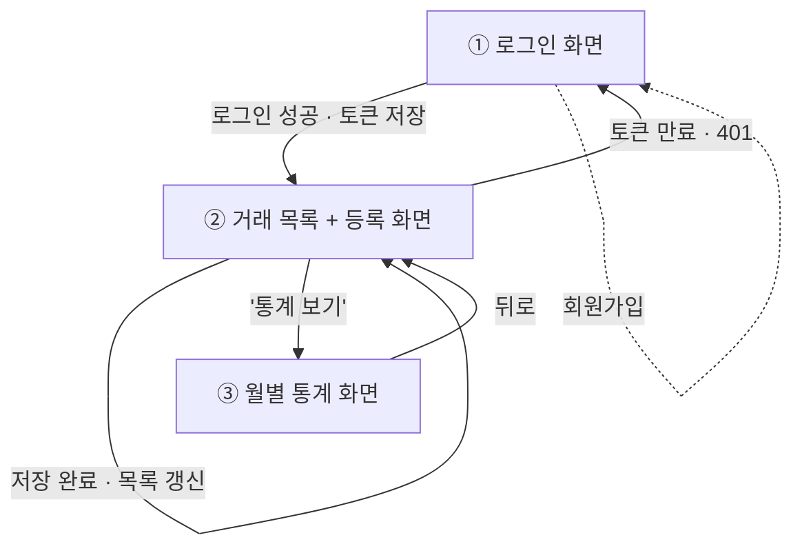

# 머니로그(MoneyLog) API 명세서

- 작성자: 정선우
- 작성일: 2026-09-01
- Base URL: `https://{배포도메인}/api` (로컬: `http://localhost:8080/api`)
- 관련 문서: [요구사항](./requirements.md) · [도메인·ERD](./erd.md) · [DDL](./schema.sql)

> 이 명세서는 이후 Swagger 문서와 대조하는 **기준**이다. 구현이 명세와 어긋나면 코드가 아니라 **명세를 먼저 갱신**한다.

---

## 0. 공통 규약

### 0-1. 응답 포맷

성공·실패 모두 같은 껍데기(response envelope)를 쓴다. 프론트는 `if (res.success)` 한 줄로 분기한다.

**성공**
```json
{ "success": true, "message": "거래내역이 등록되었습니다.", "data": { } }
```

**목록** — 데이터는 `data`, 페이지 상태는 `meta.pagination`으로 분리한다.
```json
{
  "success": true,
  "message": "거래내역 목록을 조회했습니다.",
  "data": { "transactions": [ ] },
  "meta": {
    "pagination": {
      "page": 0, "size": 20,
      "totalItems": 42, "totalPages": 3,
      "hasNext": true, "hasPrev": false
    }
  }
}
```

**실패**
```json
{ "success": false, "code": "TRANSACTION_NOT_FOUND", "message": "거래내역을 찾을 수 없습니다.", "data": null }
```

**검증 실패**는 `data`에 필드별 사유를 담는다. (D-11)
```json
{
  "success": false, "code": "VALIDATION_ERROR",
  "message": "입력값이 올바르지 않습니다.",
  "data": [
    { "field": "amount", "reason": "금액은 0보다 커야 합니다." },
    { "field": "transactionDate", "reason": "거래일은 필수입니다." }
  ]
}
```

| 필드 | 의미 |
|------|------|
| `success` | 성공 여부 |
| `message` | 사용자에게 보여줄 한글 안내 |
| `data` | 실제 데이터 본체. 없으면 `null` |
| `code` | 프론트가 분기·국제화에 쓰는 기계용 식별자 (대문자 스네이크). 실패 시에만 |
| `meta.pagination` | 목록 조회에만 |

### 0-2. 인증

- 로그인 시 발급된 JWT를 **`Authorization: Bearer {accessToken}`** 헤더로 보낸다.
- 인증 불필요 엔드포인트는 **회원가입·로그인 둘뿐**이다.
- **`userId`는 요청 바디·쿼리·경로 어디로도 받지 않는다.** 항상 토큰에서 꺼낸다. (D-3)

### 0-3. 상태 코드

| 코드 | 사용 상황 |
|------|-----------|
| 200 | 조회·수정·삭제 성공 |
| 201 | 생성 성공 (회원가입, 거래·카테고리·예산 등록) |
| 400 | 검증 실패, 잘못된 파라미터 |
| 401 | 토큰 없음·만료·위조, 로그인 실패 |
| 404 | 리소스 없음 **또는 내 것이 아님** (D-4) |
| 409 | 중복·충돌 (이메일 중복, 사용 중인 카테고리 삭제) |
| 500 | 서버 오류 |

### 0-4. 데이터 형식

| 항목 | 형식 | 예 |
|------|------|-----|
| 날짜 | `yyyy-MM-dd` (LocalDate) | `2026-09-01` |
| 시각 | ISO-8601 (LocalDateTime) | `2026-09-01T14:30:00` |
| 월 | `yyyy-MM` | `2026-09` |
| 금액 | 정수(원, long) | `12000` |
| 타입 | `INCOME` \| `EXPENSE` | |

페이징 기본값 `page=0&size=20` (page는 0부터), 기본 정렬 `transactionDate DESC, id DESC`.

---

## 1. 인증 (Auth)

| 메서드 | 경로 | 설명 | 요청 바디 | 응답 | 인증 |
|--------|------|------|-----------|------|:---:|
| POST | `/api/auth/signup` | 회원가입 | `{email, password, nickname}` | 201 · 생성된 사용자 요약 | ✕ |
| POST | `/api/auth/login` | 로그인(JWT 발급) | `{email, password}` | 200 · `{accessToken}` | ✕ |
| GET | `/api/users/me` | 내 정보 | — | 200 · `{id, email, nickname}` | ✅ |

**POST /api/auth/login**
```json
// 요청
{ "email": "sun@moneylog.com", "password": "pass1234!" }
```
```json
// 응답 200
{ "success": true, "message": "로그인에 성공했습니다.",
  "data": { "accessToken": "eyJhbGciOiJIUzI1NiJ9..." } }
```

- 회원가입 시 **기본 카테고리 6개를 시드**한다 — 지출: 식비/교통/주거/문화, 수입: 급여/용돈. (F-02)
- 비밀번호는 BCrypt 해시로 저장하고 **응답에 절대 포함하지 않는다.**
- 이메일 중복 → `409 DUPLICATE_EMAIL`.
- 이메일이 없든 비밀번호가 틀리든 **똑같이 `401 INVALID_CREDENTIALS`**. (D-8)

---

## 2. 카테고리 (Category)

| 메서드 | 경로 | 설명 | 요청 바디 | 응답 | 인증 |
|--------|------|------|-----------|------|:---:|
| GET | `/api/categories` | 내 카테고리 목록 (`?type=EXPENSE` 필터 가능) | — | 200 · `[{id, name, type}]` | ✅ |
| POST | `/api/categories` | 추가 | `{name, type}` | 201 · 생성된 카테고리 | ✅ |
| PUT | `/api/categories/{id}` | 수정 | `{name, type}` | 200 · 수정된 카테고리 | ✅ |
| DELETE | `/api/categories/{id}` | 삭제 | — | 200 | ✅ |

- 같은 이름+타입 중복 → `409 DUPLICATE_CATEGORY`.
- **거래가 달린 카테고리는 삭제 불가** → `409 CATEGORY_IN_USE`. (erd.md D-2)
- **거래가 달린 카테고리는 타입 변경 불가** → `409 CATEGORY_TYPE_CHANGE_NOT_ALLOWED`. 이름만 바꾸는 것은 허용한다. (erd.md D-1, 아래 D-16)
- 목록은 페이징하지 않는다. 개인 카테고리는 많아야 수십 개다.

---

## 3. 거래내역 (Transaction)

| 메서드 | 경로 | 설명 | 요청 바디 | 응답 | 인증 |
|--------|------|------|-----------|------|:---:|
| GET | `/api/transactions?yearMonth=2026-09&type=EXPENSE&categoryId=3&page=0&size=20` | 목록(필터+페이징) | — | 200 · 목록 + `meta.pagination` | ✅ |
| POST | `/api/transactions` | 등록 | `{type, amount, categoryId, description, transactionDate}` | 201 · 생성된 거래 | ✅ |
| GET | `/api/transactions/{id}` | 상세 | — | 200 · 거래 1건 | ✅ |
| PUT | `/api/transactions/{id}` | 수정(전체 교체) | 등록과 동일 | 200 · 수정된 거래 | ✅ |
| DELETE | `/api/transactions/{id}` | 삭제 | — | 200 | ✅ |

**POST /api/transactions**
```json
// 요청
{ "type": "EXPENSE", "amount": 12000, "categoryId": 3,
  "description": "점심 - 김치찌개", "transactionDate": "2026-09-01" }
```
```json
// 응답 201
{ "success": true, "message": "거래내역이 등록되었습니다.",
  "data": { "id": 42, "type": "EXPENSE", "amount": 12000,
            "categoryId": 3, "categoryName": "식비",
            "description": "점심 - 김치찌개",
            "transactionDate": "2026-09-01",
            "createdAt": "2026-09-01T12:31:05" } }
```

**검증**
- `amount > 0`, `transactionDate` 필수, `type`은 INCOME/EXPENSE만, `categoryId` 필수.
- **`categoryId`가 내 카테고리인지** → 아니면 `404 CATEGORY_NOT_FOUND`.
- **카테고리의 type과 요청 type이 일치하는지** → 불일치 시 `400 CATEGORY_TYPE_MISMATCH`. *(erd.md D-1에서 "서비스 레이어에서 검증한다"고 정한 그 지점)*

**조회 파라미터**

| 파라미터 | 필수 | 기본값 | 예 |
|----------|:---:|--------|-----|
| `yearMonth` | ✕ | 이번 달 | `2026-09` |
| `type` | ✕ | 전체 | `EXPENSE` |
| `categoryId` | ✕ | 전체 | `3` |
| `page` | ✕ | `0` | |
| `size` | ✕ | `20` (최대 100) | |

- 목록 항목은 `categoryId`와 함께 **`categoryName`을 평면으로 내려준다.** 안 그러면 프론트가 목록 한 번 그리려고 카테고리 API를 또 부른다. (D-7)
- 단건·수정·삭제 쿼리에는 항상 `AND user_id = {로그인 사용자}`가 붙는다. 없거나 내 것이 아니면 `404 TRANSACTION_NOT_FOUND`. (D-4)

---

## 4. 통계 (Statistics)

| 메서드 | 경로 | 설명 | 응답 | 인증 |
|--------|------|------|------|:---:|
| GET | `/api/statistics/monthly?yearMonth=2026-09` | 월별 통계 | 200 · `{income, expense, balance, byCategory}` | ✅ |

```json
{ "success": true, "message": "월별 통계를 조회했습니다.",
  "data": {
    "income": 2500000,
    "expense": 830000,
    "balance": 1670000,
    "byCategory": [
      { "categoryId": 3, "categoryName": "식비", "total": 420000 },
      { "categoryId": 5, "categoryName": "문화", "total": 230000 },
      { "categoryId": 4, "categoryName": "교통", "total": 180000 } ] } }
```

- `yearMonth` 생략 시 이번 달.
- **`balance = income - expense`를 서버가 계산해 내려준다.** 진실의 원천은 하나여야 하고, 프론트가 다시 계산하면 화면마다 값이 갈릴 수 있다.
- `byCategory`는 **지출만**, 합계 내림차순. (수입은 카테고리가 1~2개라 집계 의미가 적다)
- 거래가 없는 달은 에러가 아니라 **0과 빈 배열**을 준다.
- **DB 집계 쿼리로 계산**한다. 전체 조회 후 애플리케이션 합산 금지. (비기능 요구사항)

---

## 5. 도전 과제 API

| 메서드 | 경로 | 설명 | 인증 |
|--------|------|------|:---:|
| GET | `/api/budgets?yearMonth=2026-09` | 월 예산 조회 · `[{id, categoryId, categoryName, limitAmount}]` | ✅ |
| POST | `/api/budgets` | 예산 설정 · `{categoryId, yearMonth, limitAmount}` (categoryId 없으면 전체 예산) | ✅ |
| PUT | `/api/budgets/{id}` | 한도 수정 | ✅ |
| DELETE | `/api/budgets/{id}` | 삭제 | ✅ |
| GET | `/api/transactions/search?keyword=커피&from=2026-09-01&to=2026-09-30&minAmount=1000&maxAmount=50000` | 거래 검색 · 페이지 응답 | ✅ |
| GET | `/api/transactions/export?yearMonth=2026-09` | CSV 내보내기 · `text/csv` | ✅ |

- API 파라미터는 `yearMonth`로 통일한다. **DB 컬럼명은 `budget_month`**(예약어 회피, erd.md D-3)이지만 **API 계약과 DB 컬럼명은 별개**다.
- 예산 도입 시 통계 응답에 `budget`, `usageRate`, `exceeded`를 덧붙여 경고를 표현한다.
- 기본 과제(F-01~F-10) 완료 후에만 착수. 착수 순번은 requirements.md 3-2절 참조.

---

## 6. 표준 에러 코드

전역 예외 처리(`@RestControllerAdvice`)에서 아래 코드/상태를 강제한다.

| HTTP | code | 상황 |
|:----:|------|------|
| 400 | `VALIDATION_ERROR` | 입력 검증 실패 (`data`에 필드별 사유) |
| 400 | `CATEGORY_TYPE_MISMATCH` | 거래 type과 카테고리 type 불일치 |
| 401 | `INVALID_CREDENTIALS` | 로그인 시 이메일/비밀번호 불일치 |
| 401 | `UNAUTHORIZED` | 토큰 없음·만료·위조 |
| 404 | `USER_NOT_FOUND` | 사용자 없음 |
| 404 | `CATEGORY_NOT_FOUND` | 카테고리 없음 또는 내 것 아님 |
| 404 | `TRANSACTION_NOT_FOUND` | 거래 없음 또는 내 것 아님 |
| 409 | `DUPLICATE_EMAIL` | 이미 가입된 이메일 |
| 409 | `DUPLICATE_CATEGORY` | 같은 이름·타입 카테고리 존재 |
| 409 | `CATEGORY_IN_USE` | 거래가 있는 카테고리 삭제 시도 |
| 409 | `CATEGORY_TYPE_CHANGE_NOT_ALLOWED` | 거래가 있는 카테고리의 타입 변경 시도 |
| 500 | `INTERNAL_ERROR` | 예기치 못한 오류 |

명명 규칙: `DUPLICATE_*`(중복), `*_NOT_FOUND`(없음), `*_ERROR`(처리 실패). 도메인별 enum이 `ErrorCode` 인터페이스를 구현한다. 필드명은 `errorCode`가 아니라 `code`로 통일했다.

---

## 7. 화면 흐름 (Flow)

**화면은 3종이다.** 흔히 4종(로그인/목록/등록/통계)으로 나누지만, 우리는 requirements.md D-1에서 **목록과 등록을 한 화면으로 통합**하기로 했다. 등록·수정은 목록 화면 안의 폼(또는 모달)으로 뜬다.



### 화면별 호출 API

| 화면 | 사용자 행동 | 호출 API |
|------|-------------|----------|
| ① 로그인 | 회원가입 | `POST /api/auth/signup` |
| ① 로그인 | 로그인 → 토큰 저장 | `POST /api/auth/login` |
| ② 목록+등록 | 진입 (토큰만 있는 상태 복구) | `GET /api/users/me` |
| ② 목록+등록 | 이번 달 목록 로드 | `GET /api/transactions?yearMonth=...&page=0&size=20` |
| ② 목록+등록 | 필터용 카테고리 드롭다운 | `GET /api/categories` |
| ② 목록+등록 | 등록 폼 열기 (카테고리 선택지) | `GET /api/categories` *(진입 시 받은 목록 재사용)* |
| ② 목록+등록 | 저장(신규) | `POST /api/transactions` |
| ② 목록+등록 | 저장(수정) | `PUT /api/transactions/{id}` |
| ② 목록+등록 | 항목 삭제 | `DELETE /api/transactions/{id}` |
| ③ 월별 통계 | 이번 달 집계 로드 | `GET /api/statistics/monthly?yearMonth=...` |

> 화면-API 매핑은 명세의 **검증 도구**다. "이 화면에 필요한 API가 명세에 없다" 또는 "명세에 있는데 아무 화면도 안 쓴다"가 보이면 그때가 설계를 고칠 타이밍이다.
> 이 표를 만들며 실제로 발견한 것: **② 화면에서 카테고리 목록을 두 번(필터용·등록 폼용) 부를 뻔했다.** 화면을 통합했으므로 진입 시 한 번 받아 두 곳에서 재사용한다.

### 대표 시나리오 — "점심값 12,000원 기록하기"

```
[로그인 화면]
   │  이메일/비번 입력 → POST /api/auth/login → accessToken 저장
   ▼
[목록+등록 화면]
   │  GET /api/users/me          (내 정보)
   │  GET /api/categories        (필터·등록 폼 공용)
   │  GET /api/transactions?yearMonth=2026-09   (이번 달 목록)
   │  '+ 거래 추가' 클릭 → 폼 열림
   │  금액 12000 / 카테고리 '식비' / 날짜 입력 → POST /api/transactions (201)
   │  목록 갱신, 방금 항목 반영됨
   │  '통계 보기' 클릭
   ▼
[월별 통계 화면]
      GET /api/statistics/monthly?yearMonth=2026-09  (총수입/총지출/잔액/카테고리별)
```

---

## 8. API 개발 우선순위

| 순위 | 묶음 | API | 이유 | 단계 |
|:--:|------|-----|------|------|
| 1 | 카테고리 | `GET/POST/PUT/DELETE /categories` | 거래가 카테고리를 참조하므로 먼저 | 1단계 |
| 2 | 거래 CRUD | `GET/POST/PUT/DELETE /transactions` | 앱의 핵심 데이터 | 1단계 |
| 3 | 인증 | `signup`, `login` | 토큰이 있어야 나머지를 인증 상태로 테스트 | 2단계 |
| 4 | 인가 | 전 엔드포인트에 user_id 조건 적용 | 인증이 붙어야 "내 것" 개념이 생김 | 2단계 |
| 5 | 목록 필터·페이징 | `GET /transactions?...` 고도화 | CRUD가 된 뒤 조회 조건 확장 | 2단계 |
| 6 | 통계 | `GET /statistics/monthly` | 거래가 쌓여야 집계 의미가 있음 | 2단계 |
| 7 | 프론트 연동 | (화면 3종) | 위 API가 준비된 뒤 | 3단계 |
| 8 | (도전) | `budgets` / `search` / `export` | 기본 완료 후 가점 | 4단계 |

인증을 1순위로 두는 구성도 흔하지만, **여기서는 카테고리·거래를 먼저 만든다.** 1단계에서 인증 없이 CRUD를 완성해 H2/MySQL로 동작을 확인하고, 2단계에서 인증·인가를 얹으면서 모든 쿼리에 `user_id` 조건을 넣는 순서다.

---

## 9. 요구사항 ↔ 엔드포인트 대조

| 기능 | 엔드포인트 |
|------|-----------|
| F-01 회원가입/로그인 | `POST /auth/signup`, `POST /auth/login`, `GET /users/me` |
| F-02 카테고리 | `GET/POST/PUT/DELETE /categories` + 가입 시 시드 |
| F-03 거래 CRUD | `POST /transactions`, `GET /transactions/{id}`, `PUT`, `DELETE` |
| F-04 목록 필터·페이징 | `GET /transactions?yearMonth&type&categoryId&page&size` |
| F-05 월별 통계 | `GET /statistics/monthly?yearMonth` |
| F-06 인가 | 전 엔드포인트 공통 규약 (0-2) |
| F-07 검증·전역 예외 | 응답 포맷(0-1) + 표준 에러 코드(6장) |
| F-09 Swagger | `@Tag`/`@Operation`, `/swagger-ui/index.html` |
| F-11 예산 · F-13 검색/CSV (도전) | 5장 |

F-08(프론트 화면)은 7장의 화면 흐름, F-10(배포)은 3단계 작업이다.

---

## 10. 설계 결정 기록

### 10-1. 초안에서 바꾼 것

| 항목 | 초안 | 채택 | 이유 |
|------|------|------|------|
| 통계 경로 | `/stats/monthly` | **`/statistics/monthly`** | 축약보다 명확한 편이 낫다. |
| 페이징 위치 | `data` 안에 PageResponse | **`data` + `meta.pagination` 분리** | 목록 데이터와 페이지 상태가 섞이지 않는다. |
| 페이징 필드 | `totalElements`, `first`, `last` | **`totalItems`, `hasNext`, `hasPrev`** | `hasNext`/`hasPrev`는 버튼 활성화에 그대로 쓴다. `page < totalPages-1` 같은 계산을 프론트가 안 해도 된다. |
| 목록 배열 키 | `data.content[]` | **`data.transactions[]`** | 무엇이 담겼는지 이름에서 드러난다. |
| 카테고리 표현 | `category: {id, name, type}` 중첩 | **`categoryId` + `categoryName` 평면** | 목록 항목이 얕아져 프론트 매핑이 단순하다. |
| 에러 코드명 | `EMAIL_DUPLICATED` | **`DUPLICATE_EMAIL`** | 영어 어순으로 더 자연스럽게 읽힌다. `DUPLICATE_*` / `*_NOT_FOUND`로 규칙 통일. |
| 통계 필드명 | `totalIncome`/`totalExpense` | **`income`/`expense`/`balance`** | 짧고 충분히 명확하다. |
| 예산 월 파라미터 | `budgetMonth` | **`yearMonth`** | 다른 API와 파라미터 이름을 통일. DB 컬럼명(`budget_month`)과 API 계약은 별개다. |

### 10-2. 흔한 구성과 다르게 정한 것

| ID | 결정 | 흔한 구성 | 근거 |
|----|------|------|------|
| **D-4** | 남의 리소스는 **404** | 403 Forbidden | 403은 "그 id는 존재한다"를 알려준다. id를 훑으면 남의 거래 개수를 추론할 수 있다. 게다가 우리는 **모든 쿼리를 `user_id`로 필터**하기로 했으므로, 남의 행은 애초에 조회 결과에 없다 → 404가 **자연스럽게 나오고 코드도 더 적다**. 403을 주려면 오히려 user_id 없이 조회한 뒤 소유자를 비교하는 단계를 따로 넣어야 한다. *(403으로 되돌리려면 예외 매핑 한 줄만 바꾸면 된다.)* |
| D-3 | `userId`를 요청으로 받지 않음 | 명시 없음 | 요청으로 받으면 남의 id를 넣는 순간 인가가 뚫린다. 토큰에서만 꺼내면 **구조적으로 불가능**해진다. |
| D-6 | 삭제도 **200 + 응답 본문** | `204 / 200` 병기 | 모든 응답을 같은 껍데기로 통일하기로 했는데 204는 본문이 없어 규약이 깨진다. 일관성을 택했다. |
| D-8 | 로그인 실패 사유 미구분 | 명시 없음 | 사유를 나누면 "이 이메일이 가입돼 있나"를 확인하는 도구가 된다. |
| D-11 | 검증 실패 시 **필드별 사유**를 `data`에 | `VALIDATION_ERROR` + 메시지 한 줄 | F-07이 "금액>0, 날짜 필수" 같은 구체적 검증을 요구한다. 프론트가 필드 옆에 에러를 표시하려면 어느 필드가 틀렸는지 알아야 한다. |
| D-12 | `GET /users/me` 추가 | 없음 | 새로고침 후 토큰만 남았을 때 로그인 상태를 복구할 방법이 필요하다. 로그인 응답에 사용자 정보를 끼워 넣는 대신 이 엔드포인트를 두어 **사용자 정보의 원천을 하나로** 유지한다. |
| D-13 | `byCategory`에 `categoryId` 포함 | `categoryName`만 | 차트 조각을 클릭해 해당 카테고리로 필터링하려면 id가 필요하다. 이름은 타입이 다르면 중복될 수도 있다. |
| D-14 | 화면 **3종** | 4종 | requirements.md D-1에서 목록·등록을 한 화면으로 통합하기로 결정. 등록은 목록 화면의 폼/모달. |
| D-15 | `CATEGORY_IN_USE`, `CATEGORY_TYPE_MISMATCH` 코드 추가 | 표준 코드표에 없음 | 각각 erd.md D-2(삭제 차단)와 D-1(type 일치 검증) 정책을 API 레벨에서 표현하려면 전용 코드가 필요하다. |
| D-16 | 거래가 달린 카테고리의 **타입 변경 차단** (`CATEGORY_TYPE_CHANGE_NOT_ALLOWED`) | 자유롭게 변경 가능 | 코드 리뷰 중 발견한 결함을 반영한 결정. erd.md D-1은 `transactions.type`을 `categories.type`의 복제본으로 두고 "두 값은 항상 같다"를 서비스가 지키기로 했는데, 검증이 거래 등록·수정 경로에만 있고 카테고리 수정 경로에는 없었다. 그래서 거래가 쌓인 뒤 카테고리 타입을 바꾸면 기존 거래는 옛 타입으로 남아 통계가 조용히 어긋났다. 비정규화를 선택하면 불변식을 지켜야 하는 지점이 **한 곳이 아니라 여러 곳**이라는 것을 놓친 사례다. |

---

## 11. 미결 사항

- **프론트 스택**: React+Vite(이미 익숙한 스택) vs 순수 HTML+fetch — 프론트 셋업 전에 결정.
- **Refresh Token**(F-14, 도전): 현재는 accessToken만. 도입 시 `POST /auth/reissue`와 쿠키 정책 추가.
- **토큰 저장 위치**: localStorage(구현 단순) vs httpOnly 쿠키(XSS에 강함). 인증 구현 시점에 결정.
- **CORS**: 프론트를 별도 nginx 컨테이너로 띄우므로 배포 도메인 기준 허용 목록 필요. 배포 시점에 결정.
