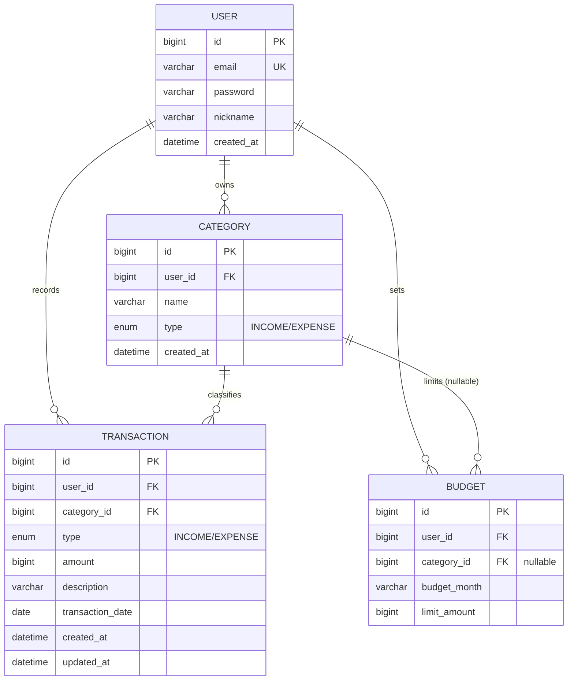

# 머니로그(MoneyLog) 도메인 모델 & ERD

- 작성자: 정선우
- 작성일: 2026-09-01
- 관련 문서: [요구사항 정의서](./requirements.md), [테이블 DDL](./schema.sql)

---

## 1. 엔티티 도출

요구사항 문장에서 "저장해야 할 명사"를 뽑은 결과.

| 명사 | 엔티티 여부 | 근거 |
|------|:---:|------|
| 사용자 | ✅ 엔티티 | 로그인 주체, 여러 명 존재, 모든 데이터의 소유자 |
| 카테고리 | ✅ 엔티티 | 사용자가 자유롭게 추가·수정·삭제, 여러 개 |
| 거래내역 | ✅ 엔티티 | 여러 건 생성, 각자 금액·날짜를 보유 |
| 예산 (도전) | ✅ 엔티티 | 월·카테고리 단위로 여러 건 존재 |
| 금액 / 날짜 / 설명 | ❌ 속성 | 거래에 딸린 값, 혼자서는 의미 없음 |
| 타입(수입/지출) | ❌ 속성(ENUM) | 값이 2개로 고정, 별도 테이블 불필요 |

**결론: 엔티티 4개 — `User`, `Category`, `Transaction`, `Budget`(도전)**

---

## 2. 엔티티 상세

### User (사용자)

로그인 주체이자 모든 데이터의 소유자.

| 컬럼 | 타입 | 제약 | 설명 |
|------|------|------|------|
| id | BIGINT | PK, AUTO_INCREMENT | 사용자 식별자 |
| email | VARCHAR(255) | NOT NULL, UNIQUE | 로그인 ID |
| password | VARCHAR(255) | NOT NULL | BCrypt 해시 (평문 저장 금지) |
| nickname | VARCHAR(50) | NOT NULL | 표시용 이름 |
| created_at | DATETIME | NOT NULL | 가입 시각 |

### Category (카테고리)

거래를 분류하는 꼬리표. 사용자마다 자기 카테고리를 가진다.

| 컬럼 | 타입 | 제약 | 설명 |
|------|------|------|------|
| id | BIGINT | PK, AUTO_INCREMENT | 카테고리 식별자 |
| user_id | BIGINT | FK → users.id, NOT NULL | 소유 사용자 |
| name | VARCHAR(50) | NOT NULL | 카테고리 이름 (식비, 급여 등) |
| type | ENUM('INCOME','EXPENSE') | NOT NULL | 수입/지출 구분 |
| created_at | DATETIME | NOT NULL | 생성 시각 |

- 회원가입 시 기본 카테고리 시드: 지출(식비/교통/주거/문화), 수입(급여/용돈)
- `(user_id, name, type)` 조합에 유니크 제약 → 같은 사용자가 같은 이름의 카테고리를 중복 생성하지 못하게 한다.

### Transaction (거래내역)

머니로그의 핵심 엔티티. 실제 수입/지출 한 건.

| 컬럼 | 타입 | 제약 | 설명 |
|------|------|------|------|
| id | BIGINT | PK, AUTO_INCREMENT | 거래 식별자 |
| user_id | BIGINT | FK → users.id, NOT NULL | 기록한 사용자 |
| category_id | BIGINT | FK → categories.id, NOT NULL | 분류 카테고리 |
| type | ENUM('INCOME','EXPENSE') | NOT NULL | 수입/지출 (D-1 참조) |
| amount | BIGINT | NOT NULL, > 0 | 금액 (원 단위 long) |
| description | VARCHAR(255) | NULL 허용 | 메모/설명 |
| transaction_date | DATE | NOT NULL | 거래 발생일 (LocalDate) |
| created_at | DATETIME | NOT NULL | 등록 시각 |
| updated_at | DATETIME | NOT NULL | 수정 시각 |

### Budget (예산) — 도전 과제

특정 월(그리고 선택적으로 특정 카테고리)의 지출 한도.

| 컬럼 | 타입 | 제약 | 설명 |
|------|------|------|------|
| id | BIGINT | PK, AUTO_INCREMENT | 예산 식별자 |
| user_id | BIGINT | FK → users.id, NOT NULL | 소유 사용자 |
| category_id | BIGINT | FK → categories.id, NULL 허용 | NULL이면 전체 예산 |
| budget_month | VARCHAR(7) | NOT NULL | 대상 월 ("2026-09") — D-3 참조 |
| limit_amount | BIGINT | NOT NULL, > 0 | 한도 금액(원) |

---

## 3. 관계

| 관계 | 의미 | FK 위치 |
|------|------|---------|
| User 1:N Category | 한 사용자가 여러 카테고리를 가진다 | categories.user_id |
| User 1:N Transaction | 한 사용자가 여러 거래를 가진다 | transactions.user_id |
| Category 1:N Transaction | 한 카테고리에 여러 거래가 속한다 | transactions.category_id |
| User 1:N Budget (도전) | 한 사용자가 여러 예산을 가진다 | budgets.user_id |
| Category 1:N Budget (도전) | 한 카테고리에 여러 월 예산이 있다 | budgets.category_id (nullable) |

1:N 관계에서 FK는 항상 **N쪽 테이블**에 놓는다.

### 왜 Transaction이 User와 Category를 둘 다 참조하는가

거래 한 건은 두 질문에 동시에 답할 수 있어야 한다.

- **"누구의 거래인가?"** → `user_id` (F-06 인가: 내 데이터만 조회/수정/삭제)
- **"무슨 분류의 거래인가?"** → `category_id` (F-04 필터, F-05 카테고리별 통계)

`user_id`가 없으면 로그인 사용자가 자기 거래만 골라낼 수 없고, `category_id`가 없으면 "이번 달 식비 총합"을 구할 수 없다. 두 FK 모두 요구사항에서 직접 나온 것이다.

> ⚠️ **모든 조회는 user_id로 필터**
> `WHERE id = 5`만 쓰면 남의 거래가 보인다. 반드시 `WHERE id = 5 AND user_id = :loginUserId` 형태로 간다.
> 이것이 인가(Authorization)의 출발점이며, 이 프로젝트의 핵심 원칙이다.

---

## 4. ERD

---

## 5. 설계 결정 기록

교안이 "스스로 정하라"고 남긴 지점과, 교안 DDL을 검토하며 발견한 문제에 대한 결정.

| ID | 항목 | 결정 | 근거 |
|----|------|------|------|
| D-1 | `transactions.type`이 `categories.type`과 중복 | **양쪽 모두 유지 + 저장 시 검증** | 통계·필터 쿼리에서 categories JOIN 없이 타입별 집계가 가능해 쿼리가 단순해진다(의도적 비정규화). 대신 거래 등록·수정 시 `category.type == transaction.type`을 서비스 레이어에서 검증해 모순 데이터를 원천 차단한다. 검증이 빠지면 "식비(EXPENSE) 카테고리인데 수입으로 기록된 거래"가 생겨 통계가 깨진다. |
| D-2 | 카테고리 삭제 시 거래 처리 | **거래가 있으면 삭제 차단** | 구현이 가장 단순하고 데이터 손실 위험이 없다. FK를 `ON DELETE RESTRICT`로 두면 DB가 1차 방어하고, 서비스에서 잡아 "사용 중인 카테고리는 삭제할 수 없습니다" 메시지로 변환한다. 사용자는 거래를 다른 카테고리로 옮긴 뒤 삭제하면 된다. |
| D-3 | `year_month` 컬럼명 | **`budget_month`로 변경** | `YEAR_MONTH`는 MySQL의 예약어(INTERVAL 단위 키워드)라 백틱 없이는 쓸 수 없고 JPA 매핑에서도 이스케이프가 필요하다. 이름을 바꾸는 편이 깔끔하다. |
| D-4 | budgets 중복 방지 | **`(user_id, category_id, budget_month)` 유니크 + 애플리케이션 검증** | 교안 설명은 유니크 키를 언급하지만 DDL에는 빠져 있었다. 다만 MySQL은 NULL을 서로 다른 값으로 취급하므로, `category_id IS NULL`인 "전체 예산"은 유니크 키만으로 중복이 막히지 않는다. 전체 예산 중복은 서비스 레이어에서 검증한다. (대안: 생성 컬럼 `IFNULL(category_id,0)`에 유니크 — schema.sql 주석 참조) |
| D-5 | 삭제 방식 | **hard delete** | 개인 가계부라 삭제 이력 추적 요구가 없고, soft delete를 넣으면 모든 조회 쿼리에 `deleted_at IS NULL`이 따라붙어 3주 일정에 복잡도만 늘어난다. 필요해지면 도전 과제로 전환. |
| D-6 | 로컬 개발 DB | **로컬도 MySQL 8 컨테이너, H2는 테스트 전용** | 운영과 같은 DB로 개발해 "로컬에선 되는데 배포하면 깨지는" 문제(ENUM·집계 함수·날짜 함수 방언 차이)를 줄인다. Docker로 띄우므로 설치 부담이 없다. |
| D-7 | 카테고리 이름 중복 | **`(user_id, name, type)` 유니크** | 같은 사용자가 "식비"를 두 개 만들면 카테고리별 통계가 둘로 쪼개져 의미가 없어진다. |
| D-8 | 금액 타입 | **`long` / BIGINT, 원 단위 정수** | 원화는 소수점이 없다. `double`은 부동소수 오차 위험, `BigDecimal`은 이 규모에 과하다. |
| D-9 | 날짜 타입 | `transaction_date`는 **DATE(LocalDate)**, 이력은 **DATETIME(LocalDateTime)** | 거래는 "며칠에 썼나"만 중요하고 시:분은 불필요. 생성/수정 이력은 시각까지 필요. |

> **ENUM과 JPA 주의**
> JPA에서 `@Enumerated`를 지정하지 않으면 기본이 `ORDINAL`(0, 1 같은 순서 저장)이라 나중에 ENUM 순서를 바꾸면 데이터가 뒤섞인다. 반드시 `@Enumerated(EnumType.STRING)`으로 문자열 저장할 것.
> 또한 Hibernate가 String 매핑 enum에 기대하는 컬럼 타입은 VARCHAR이므로, `ddl-auto: validate`로 운영할 계획이라면 DDL의 `ENUM(...)`을 `VARCHAR(10) + CHECK`로 바꾸는 편이 안전하다. 현재는 JPA가 테이블을 생성(`ddl-auto`)하고 schema.sql은 설계 검증용 문서로 둔다.

---

## 6. 이 설계가 커버하는 요구사항

| 요구사항 | 설계 대응 |
|----------|-----------|
| F-01 회원가입/로그인 | users(email UNIQUE, password BCrypt) |
| F-02 카테고리 시드 + CRUD | categories(user_id, name, type) + 가입 시 6건 시드 |
| F-03 거래 CRUD | transactions 전체 |
| F-04 목록 필터·페이징 | transactions(user_id, transaction_date) 인덱스 + type/category_id 조건 |
| F-05 월별 통계 | transactions에서 user_id + 월 범위 집계, category_id로 GROUP BY |
| F-06 인가 | 모든 테이블에 user_id 보유 → 전 쿼리 user_id 조건 |
| F-11 예산(도전) | budgets |
